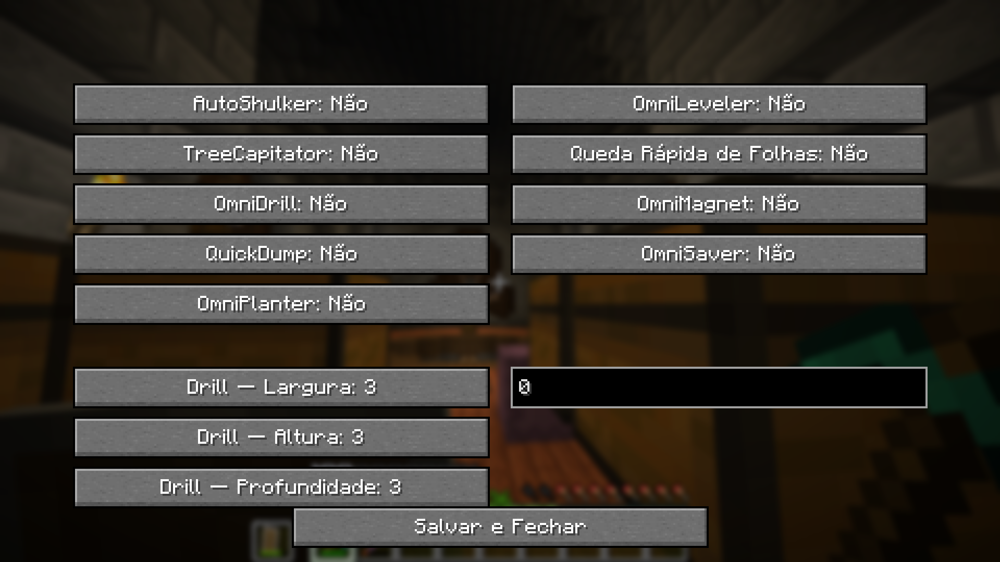

# OmniTweaks

<p align="center">
  
</p>

<p align="center">
  
</p>

Mod modular de Quality of Life para **Minecraft 26.1.1** (Fabric). Desenvolvido para simplificar tarefas repetitivas e melhorar a experiência de jogo com recursos personalizáveis.

---

## Módulos

O mod é composto por vários módulos que podem ser ativados de forma independente. Use a tecla **'O'** para abrir a interface de configuração ou utilize os comandos abaixo.

| Comando | Descrição |
|---------|-----------|
| `/ot autoshulker` | Coleta automática de itens para Shulker Boxes no inventário |
| `/ot treecapitator` | Derruba árvores inteiras ao quebrar um único bloco de tora |
| `/ot drill` | Ativa o OmniDrill (mineração em área padrão 3×3) |
| `/ot drill <L> <A> <P>` | Personaliza área do Drill (Largura, Altura, Profundidade 1–8) |
| `/ot quickdump` | Esvazia Shulker Boxes rapidamente em baús (Sneak + Click Direito) |
| `/ot omniplanter` | Planto automático de sementes em área |
| `/ot omnileveler` | Mineração em linha reta ou aplainamento (Y customizável) |
| `/ot fastdecay` | Acelera significativamente o desaparecimento das folhas |
| `/ot omnimagnet` | Atrai itens próximos para o jogador |
| `/ot omnisaver` | Protege ferramentas e itens importantes antes de quebrarem |

O alias `/omnitweaks` também funciona para todos os comandos acima.

---

## Pré-requisitos

| Ferramenta | Versão mínima | Observação |
|------------|--------------|------------|
| **Java** | 25 | MC 26.1.1 exige Java 25 (`java-runtime-epsilon`) |
| **Git** | qualquer | Para clonar o repositório |

> [!NOTE]
> **Não é necessário ter o Gradle instalado globalmente.** O projeto inclui o Gradle Wrapper (`gradlew.bat`).

---

## Como compilar

```bat
:: 1. Clone o repositório
git clone https://github.com/jovinull/OmniTweaks.git
cd OmniTweaks

:: 2. Compile (Windows)
./gradlew build

:: 3. O JAR gerado estará em:
::    build\libs\omnitweaks-1.0.0.jar
```

No primeiro build, o Gradle Wrapper baixará automaticamente o Gradle 9.4.0 e o Minecraft 26.1.1. Isso pode demorar alguns minutos.

---

## Instalação

1. Instale o [Fabric Loader 0.18.6](https://fabricmc.net/use/installer/) para Minecraft 26.1.1
2. Instale o [Fabric API 0.145.3+26.1.1](https://modrinth.com/mod/fabric-api)
3. Copie `build\libs\omnitweaks-1.0.0.jar` para a pasta `mods` do seu Minecraft.

---

## Informações Técnicas

| Dependência | Versão |
|-------------|--------|
| Minecraft | 26.1.1 |
| Fabric Loader | 0.18.6 |
| Fabric API | 0.145.3+26.1.1 |
| Gradle Wrapper | 9.4.0 |

### Notas de Desenvolvimento
- O Minecraft 26.1.1 é distribuído **sem obfuscação**.
- O projeto usa `noIntermediateMappings` para evitar remapeamento desnecessário.
- Bytecode compilado para Java 25.

---

## Contribuindo

Contribuições são bem-vindas! Sinta-se à vontade para abrir uma **issue** ou enviar um **Pull Request**.

---

## Licença

Este projeto está licenciado sob a **MIT License**. Veja o arquivo [LICENSE](LICENSE) para mais detalhes.
